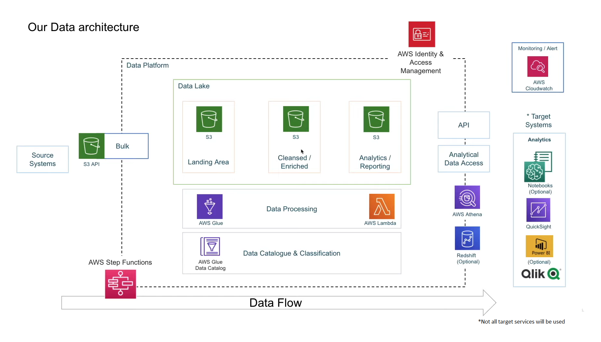

# Youtube Analysis using Data Engineering

## Introduction

This project demonstrates how to use data engineering techniques to analyze YouTube data. The data is obtained through the YouTube Data API and is processed using AWS services such as Glue, Redshift, and Quicksight. This pipeline can be used as a starting point for more advanced analysis and visualization of YouTube data.

## Architecture 

## Technology Used

- Python and PySpark
- SQL
- AWS CLI
- AWS Services
1. Athena
2. Glue
3. Redshift
4. S3
5. IAM
6. Lambda
7. Quicksight

## Dataset Used

Here is the dataset used in the project - https://www.kaggle.com/datasets/datasnaek/youtube-new

